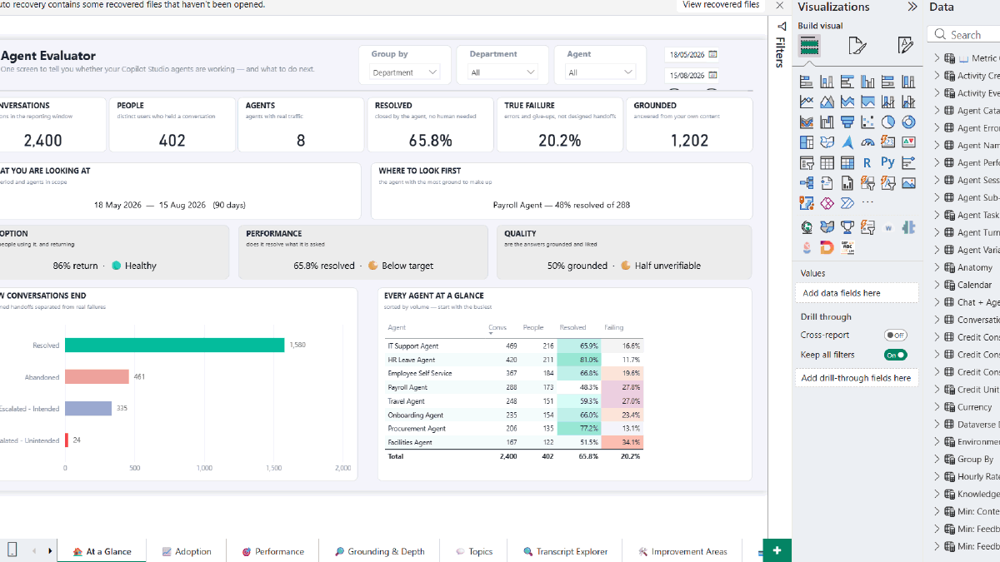

<div align="center">

# 🔎 Agent Evaluator

#### by Microsoft Business Value Advisory (BVA)

### **for Copilot Studio** — one Power BI template for **deep agent performance & evaluation**: quality, containment, topics, transcripts, errors, feedback, and message-credit consumption.

[](https://github.com/microsoft/AgentEvaluator-for-Copilot-Studio)
[](#get-started)
[](#pick-a-source)
[](https://github.com/microsoft/AgentEvaluator-for-Copilot-Studio/stargazers)

**Agent sessions · turns · errors · sub-agent calls · quality & performance · topics · knowledge files ·
user feedback · Copilot Studio message-credit consumption** — purpose-built to analyse how your
**Copilot Studio agents** actually perform, resolve, contain, and cost.



> *Demo shown with anonymised sample data.*

Found this useful? ⭐ **Star this repo to help others discover it!**

**[Get started ↓](#get-started)**

</div>

## Watch first

Plays here in the page — no download.

**Demo — what the report covers, page by page** *(1m 53s)*

<!-- VIDEO: replace this line with the https://github.com/user-attachments/assets/<id> URL
     produced by dragging media/AgentEvaluator-Demo.mp4 into a new issue comment.
     A bare attachment URL on its own line renders as an inline player. -->
https://github.com/microsoft/AgentEvaluator-for-Copilot-Studio/raw/main/media/AgentEvaluator-Demo.mp4


<details>
<summary>⚠️ <strong>Usage & compliance disclaimer</strong></summary>

While this tool helps customers understand the business value of their AI usage data, Microsoft has
**no visibility** into the data customers input, nor control over how the template is used. Customers
are solely responsible for ensuring their use complies with all applicable laws and regulations
(including data privacy and security). **Microsoft disclaims all liability** arising from use of this
template.

This is an **experimental** template that reads Copilot Studio conversation transcripts from
Dataverse. Transcripts are intended to give visibility into agent interactions, not to serve as the
sole source of truth for licensing or full-fidelity reporting. Not supported through Microsoft
support channels — please open an issue in this repo.
</details>

---

## Get started

Download **[`Agent Evaluator.pbit`](./Agent%20Evaluator.pbit)**, open it in Power BI Desktop, and
answer the first prompt.

That prompt is **Source Mode**, and it is the only answer that matters — it decides which of the
remaining parameters apply. Leave the rest at their defaults and the report builds itself from the
sample data bundled in [`data/`](./data/).

```
Source Mode  =  TranscriptCSV   ->  reads data/ - no tenant, no capacity
                Dataverse       ->  reads live transcripts, parsed in-model
                Fabric          ->  reads Delta tables written by the notebooks
```

**New here?** Take `TranscriptCSV` with the bundled sample data. The whole dashboard renders in
about two minutes, on a laptop, with nothing to stand up.

---

## Pick a source

One template, three ways to feed it. Every page works on every path except the credit-consumption
pages, which need the PPAC export that only the Fabric path ingests.

| | Local CSV | Dataverse | Fabric |
|---|---|---|---|
| Set up | ✅ lowest — open, pick a folder | low — open, paste a URL | notebooks + Lakehouse |
| Infrastructure | none | none | Fabric capacity + Lakehouse |
| Tenant required | ✖ none | Dataverse environment | Fabric capacity |
| Transcript pages | ✅ | ✅ | ✅ |
| Message-credit pages | ✖ | ✖ | ✅ |
| Refreshing data | ✖ static file | ✅ live | ✅ scheduled |
| Best volume | demo / offline | small–medium (~30-day retention) | large / historical |
| Multi-environment | ✖ | ✅ one or many URLs | via Lakehouse |
| Guide | [local-csv.md](./docs/local-csv.md) | [dataverse.md](./docs/dataverse.md) | [fabric.md](./docs/fabric.md) |

---

## What you get

Nine pages, in the order you would actually ask the questions.

| Page | The question it answers |
|---|---|
| **Agent Evaluator** | Are the agents working, and what should I look at first? |
| **Adoption & Reach** | Is anyone using this — and do they come back? |
| **Performance** | Does it resolve what it is asked, and where does it break? |
| **Grounding & Depth** | What did the agent draw upon to answer? |
| **Topics & Themes** | What are people actually asking for — and can we answer it? |
| **Transcript Explorer** | Show me a real conversation, the evidence behind the numbers. |
| **Improvement Areas** | What should we fix first? |
| **Credit Consumption** | What is it costing, and where does the spend go? |
| **CSAT & Feedback** | Do users say it helped — and what do they say? |

A **designed escalation is not a failure.** The report separates handoffs that are correct behaviour
from errors and give-ups, so containment is not quietly overstated.

---

## Repository layout

```
Agent Evaluator.pbit     the template - all three paths
data/                    sample transcripts + org data (used by TranscriptCSV)
docs/                    per-path setup guides
fabric/notebooks/        transcript parser + credit-consumption ingester
fabric/flows/            Power Automate flows for the PPAC credit export
tools/                   sample-data generator and validator
media/                   demo video
```

---

## About

Agent Evaluator is created and maintained by the **Microsoft Business Value Advisory (BVA)** team.

Part of the [Analytics Hub](https://microsoft.github.io/Analytics-Hub/) — open-source Power BI
templates and exporters for measuring Microsoft Copilot adoption, impact, and cost.
